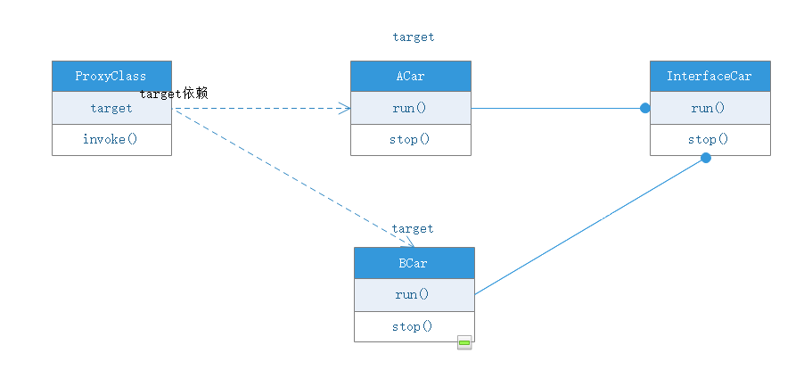
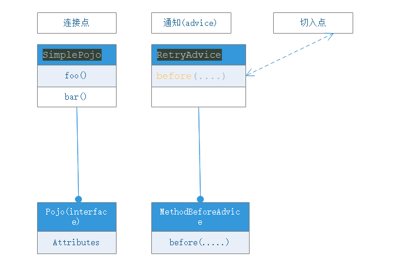

# spring-boot-aop
spring boot + aop

# AOP原理详解

我们都知道，aop的原理就是动态代理，所以首先来介绍下java的动态代理

## 动态代理方式
主要有两种：
1. jdk自带动态代理
2. cglib

### JDK自带动态代理

>> JDK自带的动态代理方式必须要被代理对象实现某些接口；

JDK动态代理所用到的代理类在程序调用到代理类对象时才由JVM真正创建，JVM根据传进来的 业务实现类对象 以及 方法名 ，动态地创建了一个代理类的class文件并被字节码引擎执行，然后通过该代理类对象进行方法调用。我们需要做的，只需指定代理类的预处理、调用后操作即可。

#### 关键代码

1. 实现InvocationHandler接口
2. 调用java.lang.reflect.Proxy类的newProxyInstance或者getProxyClass方法

将被代理类传给即将生成的代理类
Proxy.newProxyInstance(target.getClass().getClassLoader(),target.getClass().getInterfaces(),this);

3. 重载invoke方法，将要处理的统一事件填入
    
    
    public Object invoke(Object proxy, Method method, Object[] args) throws Throwable {.....}

#### 关键源码分析
    
    newProxyInstance ---> getProxyClass0 --->proxyClassCache.get(loader, interfaces)--->Object subKey = Objects.requireNonNull(subKeyFactory.apply(key, parameter));---->ProxyClassFactory.apply 

#### apply方法里关键代码：

//生成代理类class文件
    
    long num = nextUniqueNumber.getAndIncrement();     
    String proxyName = proxyPkg + proxyClassNamePrefix + num; 
    byte[] proxyClassFile = ProxyGenerator.generateProxyClass(proxyName, interfaces, accessFlags);

### CGLIB

cglib是针对类来实现代理的，原理是对指定的业务类生成一个子类，并覆盖其中业务方法实现代理。因为采用的是继承，所以不能对final修饰的类进行代理。

demo中使用的是apache实现的cglib动态代理类：

github地址：

    https://github.com/cglib/cglib

在这个项目中，我用apache的cglib实现去模拟spring aop的工作原理

## 自定义类加载器

Javassist是一个编辑字节码的框架，可以让你很简单地操作字节码。它可以在运行期定义或修改Class。使用Javassist实现AOP的原理是在字节码加载前直接修改需要切入的方法。这比使用Cglib实现AOP更加高效，并且没太多限制

## 什么是spring的AOP

Aspect-Oriented Programming 
就是面向切面编程。

先引入官方文档的介绍：

我看的是4.3.12的文档，[地址在这里](https://docs.spring.io/spring/docs/4.3.12.BUILD-SNAPSHOT/spring-framework-reference/htmlsingle/#overview-aop-instrumentation)

>> AOP and Instrumentation
The spring-aop module provides an AOP Alliance-compliant aspect-oriented programming implementation allowing you to define, for example, method interceptors and pointcuts to cleanly decouple code that implements functionality that should be separated. Using source-level metadata functionality, you can also incorporate behavioral information into your code, in a manner similar to that of .NET attributes.
>>
>> The separate spring-aspects module provides integration with AspectJ.
>>
>> The spring-instrument module provides class instrumentation support and classloader implementations to be used in certain application servers. The spring-instrument-tomcat module contains Spring’s instrumentation agent for Tomcat.

也就是说，aop的核心是用AspectJ集成了spring-aspects，和spring-instrument工具模块组成。

那AspectJ是个什么玩意？

[看看它的官网](http://www.baeldung.com/aspectj)

看文档中介绍：
>> The separate spring-aspects module provides integration with AspectJ.

是不是aop的实现就是用的AspectJ的源码来实现的呢？
答案当然不是，而是用的AspectJ的织入风格。

看spring官网的说法：

>> Aspect: a modularization of a concern that cuts across multiple classes. Transaction management is a good example of a crosscutting concern in enterprise Java applications. In Spring AOP, aspects are implemented using regular classes (the schema-based approach) or regular classes annotated with the @Aspect annotation (the @AspectJ style).

看关键字，`the @AspectJ style`,用的是AspectJ的风格。

而他的实现是eclipse社区实现的：

>> @AspectJ refers to a style of declaring aspects as regular Java classes annotated with annotations. The @AspectJ style was introduced by the AspectJ project as part of the AspectJ 5 release. Spring interprets the same annotations as AspectJ 5, using a library supplied by AspectJ for pointcut parsing and matching. The AOP runtime is still pure Spring AOP though, and there is no dependency on the AspectJ compiler or weaver.
https://www.eclipse.org/aspectj/

用的是eclipse的aspectJ的5.0 Reliase版本。

[AspectJ的介绍](https://docs.spring.io/spring/docs/current/spring-framework-reference/core.html#aop-ataspectj)

[springAOP官网介绍](https://docs.spring.io/spring/docs/4.3.12.BUILD-SNAPSHOT/spring-framework-reference/htmlsingle/#aop-introduction)

[eclipse的AspectJ](https://www.eclipse.org/aspectj/)

## aspectJ什么风格？

aspectJ的官网上说：
>> AspectJ provides an implementation of AOP and has three core concepts:
>>   
>>   Join Point
>>   Pointcut
>>   Advice

也就是凡是包含这三种概念的，都是AspectJ的风格。

至于aspectJ的原理，其实也是基于JDK动态代理和cglib去实现的。

## spring AOP动态代理实现方式

spring采用了两种动态代理去实现。根据可用性，首选jdk动态代理(接口的情况下)，jdk不满足时，会采用cglib实现。

[AOP动态代理选用](https://docs.spring.io/spring/docs/4.3.12.BUILD-SNAPSHOT/spring-framework-reference/htmlsingle/#aop-proxying)

spring默认是用的这种方式。

如果想直接使用cglib去实现动态代理的话，则需要在配置文件中配置这项(默认为false)：
    
    spring.aop.proxy-target-class=true

## 如何使用

### Join Point

Join Point字面意思就是连接点，那什么是连接点呢？

先来看看spring AOP中关于AspectJ的aop概念介绍：

[官网介绍](https://docs.spring.io/spring/docs/4.3.12.BUILD-SNAPSHOT/spring-framework-reference/htmlsingle/#aop-introduction-defn)

>> Join point: a point during the execution of a program, such as the execution of a method or the handling of an exception. In Spring AOP, a join point always represents a method execution.

简单说就是在程序执行的时候所表现的一个点。
在spring中，join point总是表现在一个方法执行上。

而Pointcut是用来匹配连接点的一个切面。

>> Pointcut: a predicate that matches join points. Advice is associated with a pointcut expression and runs at any join point matched by the pointcut (for example, the execution of a method with a certain name). The concept of join points as matched by pointcut expressions is central to AOP, and Spring uses the AspectJ pointcut expression language by default.

**ps:
Pointcut切入方法在被执行前会被代理方法(target source)所覆盖**

## 翻译名词定义

* target

被代理目标对象

* Join point

连接点，连接被代理对象与代理对象的切入点，简单说就是对象的某个方法`method`

* Pointcut

切入点，简单来说就是写的拦截方法类，是在invoke方法里去加判断规则的。

* Advice 通知方式，在这里是下面例子的`RetryAdvice`

* target source

就是最后生成的代理类源对象

先来看看jdk动态代理的方式，需要给汽车加上记录开车时间的记录，则设计如下：

spring的动态代理方式：

代码参考另一个专门介绍动态代理的项目：

[daynmaicTest](https://github.com/huguiqi/dynamicproxytest.git)

## 官方例子展示

官方例子写的非常含蓄，现将例子重新整理一遍

SimplePojo.java:

    public class SimplePojo implements Pojo {

        public void foo() {
            // this next method invocation is a direct call on the 'this' reference
            this.bar();
        }
    
        public void bar() {
            // some logic...
        }
    }

Pojo.java:

    public interface Pojo {
    
        public void foo();
    
        public void bar();
    }
    
    
    
    
RetryAdvice.java:    
    
    public class RetryAdvice implements MethodBeforeAdvice {
    
        @Override
        public void before(Method method, Object[] objects, Object o) throws Throwable {
            if (method.getName().equals("foo")){
                System.out.println("check password");
            }
        }
    }
    

### 使用方式

SpringAopTest.java:
    
    
    public class SpringAopTest {
    
    
        @Test
        public void testSpringAop(){
            //1. 设置被代理对象(target)，而SimplePojo的foo方法就是切入点：Join Point
            ProxyFactory factory = new ProxyFactory(new SimplePojo());
            //2.将被代理对象的接口类添加进去(其实也可以不加,暂时还不清楚它有什么作用)
    //        factory.addInterface(Pojo.class);
            //3, 添加advice拦截,拦截中的before方法就是Pointcut
            factory.addAdvice(new RetryAdvice());
                //是否暴露被代理目标类
            factory.setExposeProxy(true);//指定对外发布代理对象，即在目标对象方法中可以通过AopContext.currentProxy()访问当前代理对象。
    //        Pojo pojo = (Pojo) factory.getProxy();
            SimplePojo pojo = (SimplePojo) factory.getProxy();
            // 这个连接点被调用时，就会调用代理类Proxy,pojo.foo()方法被调用前会被proxy的target source所覆盖(这里新的代理类名称(target source)是：SingletonTargetSource)
            pojo.foo();
        }
    
    }
    
    
    
# 自定义注解

例子，需要设计一个注解标签，用来检查当前方法是否有权限被用户访问

## 固定写法

* 必须是接口

* 需要加上以下注解

    
    @Target({ElementType.METHOD})
    @Retention(RetentionPolicy.RUNTIME)
    @Documented

 
 如果需要在方法上添加注解，则target的值是`METHOD`,加类上则值是`TYPE`
 
 https://www.mkyong.com/java/java-custom-annotations-example/
 
 
 http://blog.csdn.net/tianyaleixiaowu/article/details/73844568
 